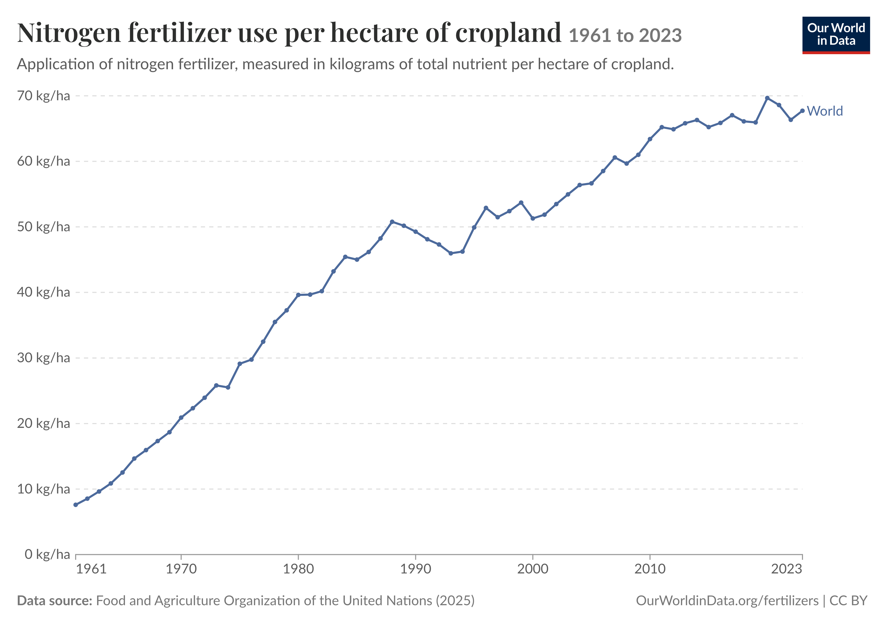

# Global Fertilizer Use and Environmental Policy

**How has global nitrogen fertilizer intensity changed since 1961, and what does that imply for nutrient-pollution policy?**



## Overview

This project studies inorganic nitrogen fertilizer use per hectare of cropland, using FAOSTAT data processed by Our World in Data. A 63-year World series and a 10-country comparison describe long-run intensity. An OLS time trend summarizes the average annual change. The economic section treats excess nitrogen as a negative production externality and compares environmental standards, nitrogen charges, insurance-style incentives, and water-quality trading.

The data measure fertilizer *application*, not nitrogen loss or water quality. The trend regression is descriptive; it is not a causal policy estimate.

## Key Findings

- Global intensity rose from **7.59 kg N/ha in 1961** to **67.72 in 2023**, with an observed peak of **69.66 in 2020**.
- An OLS trend on 63 World observations estimates an average increase of **0.968 kg N/ha per year** (OLS SE 0.031; 95% CI 0.906 to 1.030; **R² = 0.941**).
- The 10-country sample (630 country-years) shows different paths: large long-run increases in China, India, Pakistan, and Brazil; declines after earlier peaks in France and Japan.
- A workable response, as argued in the paper, combines a regulatory floor in vulnerable areas with a gradual charge on *verified surplus*, flexible compliance, and temporary support for monitoring.

## Data

FAOSTAT *Fertilizers by Nutrient*, downloaded through [Our World in Data](https://ourworldindata.org/grapher/nitrogen-fertilizer-application-per-hectare-of-cropland) (full download plus a 10-country displayed-data extract). Coverage is 1961–2023. See [`data/README.md`](data/README.md).

## Methods

1. Clean and validate the World series, regional aggregates, and ten-country panel.
2. Estimate `nitrogen_kg_ha ~ t` by OLS, with `t = 0` in 1961. Newey–West standard errors are also reported as a robustness check.
3. Plot the global series, FAO regional aggregates, and a textbook negative-production-externality diagram (MPB, MPC, MSC, Q*, Qm, deadweight loss).
4. Compare command-and-control standards, Pigouvian / surplus charges, insurance incentives, and water-quality trading using published policy evidence (not estimated from the FAO series).

## Reproducing the Analysis

From the repository root, with R 4.5+ and packages `ggplot2`, `dplyr`, `scales`, `sandwich`, and `lmtest`:

```bash
Rscript R/run_all.R
```

Or run `R/01_data_cleaning.R`, `R/02_analysis.R`, and `R/03_visualization.R` in that order. Source CSVs are already in `data/source/`.

## Repository Structure

```text
R/                 cleaning, OLS/HAC analysis, figures
data/              source CSVs, processed series, data notes
figures/           README figure and additional charts
tables/            regression and coverage output
reports/           final paper (PDF) and manuscript
sessionInfo.txt    R session used for the original run
```

## Limitations

The FAO/OWID series is an input-intensity measure. It excludes manure, does not record crop uptake or leaching, and includes reporting and estimation noise. The ten countries are not a statistical sample of the world. The OLS fit is a straight line through a series that also has plateaus and reversals. Policy recommendations therefore rest on the externality model and cited program evidence, not on a causal estimate from these data.

## Academic Context

Independent data project for **ECON 415** (Environmental Economics), University of Illinois Urbana-Champaign, Summer 2026. The paper in `reports/` is the course write-up; this README is the portfolio summary.

## Authors / Contributions

**Hexu Jin** — data construction, statistical analysis, figures, and writing.

## Contact

[jinhexu6@gmail.com](mailto:jinhexu6@gmail.com)
